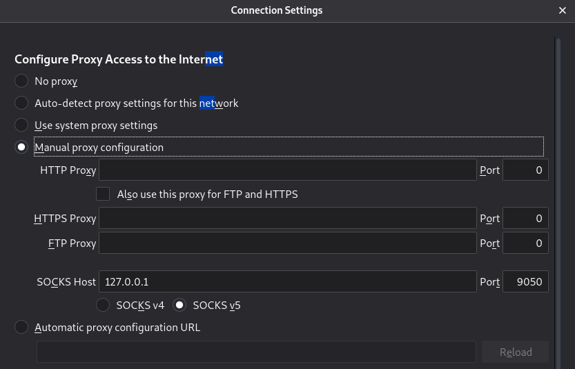

# Recursos de Hacking Ético

## 5.1 Instalando Tor en Kali

En algunas versiones de Kali viene instalado Tor. Si no fuese así podríamos instalarlo desde la terminal:

```sh
$ apt-get install tor
```

Después para iniciar el servicio ejecutamos:

```sh
$ service tor star
```

Y podemos comprobar su estado con:

```sh
$ service tor status
```

Lo normal será tener un puerto (9050) escuchando podemos verlo si ejecutamos:

```sh
$ netstat -ano | head
```

Una vez que sabemos donde está levantado podemos establecer un proxy manual en nuestro navegador para que use ese puerto. En el caso de Firefox deberíamos ir a network settings e indicarle el puerto como se muestra en la siguiente imagen:



Para comprobar que todo está correcto podemos usar cualquier servicio de Internet que nos da la IP que tenemos y ver que es distinta a la habitual.
Si queremos parar el servicio de Tor podemos hacer:

```sh
$ service tor stop
```


[Volver al inicio](./../../README.md)
