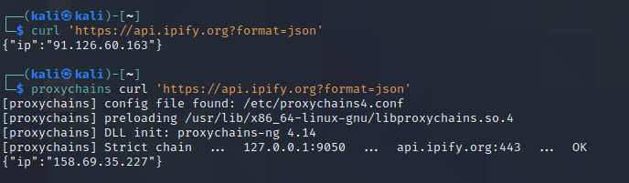
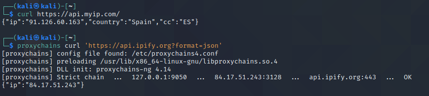

# Recursos de Hacking Ético

## 5.1 Proxies

En Internet hay varios sitios donde podemos encontrar una lista de proxies públicos y gratuitos de los que podemos hacer uso. El problema de usar proxies públicos es que al ser gratis puede darse el caso de que estén sniffando el tráfico que pasa por ese proxy por lo cual no es muy recomendable hacer nada que nos identifique o pasar por ellos información sensible.
Hay varias formas de usar proxies. Y vamos a verlas en detalle a continuación.

### Proxy web

Un proxy web es una página web donde podemos indicarle la página web que queremos visitar y a través de su servidor nos da una respuesta y nos la muestra en el navegador. Hay varios de este tipo y solo tendríamos que googlear "free proxy web". Uno de los más famosos es [proxysite](https://www.proxysite.com/).

Si, por ejemplo, buscamos cualesmiip.com en el buscador que ofrece veremos como nos da una ip totalmente distinta a la nuestra. Además, podemos decirle que servidor queremos utilizar.

### Proxy a través de nuestro navegador

Esta forma ya hemos visto como utilizar y se trataba de indicarle al navegador que proxy tiene que utilizar para poder salir por el.

### Proxychains

Es un software que nos permite que proxy queremos utilizar e incluso nos permite encadenar varios proxies. Lo malo de hacer esto es que si la conexión ya es lenta cuando utilizamos un proxy gratuito puede llegar a ser muy muy lenta cuando encadenamos varios. Es muy útil cuando no queremos establecer un proxy a nivel del sistema y solamente utilizarlo para ciertas aplicaciones.

Por defecto, la configuración que viene con proxychains es para utilizarlo con la red Tor pero esto lo podemos cambiar usando el fichero de configuración de proxychains que se encuentra en `etc/proxychains.conf` y contiene la siguiente configuración:

```sh
# proxychains.conf  VER 4.x
#
#        HTTP, SOCKS4a, SOCKS5 tunneling proxifier with DNS.


# The option below identifies how the ProxyList is treated.
# only one option should be uncommented at time,
# otherwise the last appearing option will be accepted
#
#dynamic_chain
#
# Dynamic - Each connection will be done via chained proxies
# all proxies chained in the order as they appear in the list
# at least one proxy must be online to play in chain
# (dead proxies are skipped)
# otherwise EINTR is returned to the app
#
strict_chain
#
# Strict - Each connection will be done via chained proxies
# all proxies chained in the order as they appear in the list
# all proxies must be online to play in chain
# otherwise EINTR is returned to the app
#
#round_robin_chain
#
# Round Robin - Each connection will be done via chained proxies
# of chain_len length
# all proxies chained in the order as they appear in the list
# at least one proxy must be online to play in chain
# (dead proxies are skipped).
# the start of the current proxy chain is the proxy after the last
# proxy in the previously invoked proxy chain.
# if the end of the proxy chain is reached while looking for proxies
# start at the beginning again.
# otherwise EINTR is returned to the app
# These semantics are not guaranteed in a multithreaded environment.
#
#random_chain
#
# Random - Each connection will be done via random proxy
# (or proxy chain, see  chain_len) from the list.
# this option is good to test your IDS :)

# Make sense only if random_chain or round_robin_chain
#chain_len = 2

# Quiet mode (no output from library)
#quiet_mode

# Proxy DNS requests - no leak for DNS data
proxy_dns

# set the class A subnet number to use for the internal remote DNS mapping
# we use the reserved 224.x.x.x range by default,
# if the proxified app does a DNS request, we will return an IP from that range.
# on further accesses to this ip we will send the saved DNS name to the proxy.
# in case some control-freak app checks the returned ip, and denies to
# connect, you can use another subnet, e.g. 10.x.x.x or 127.x.x.x.
# of course you should make sure that the proxified app does not need
# *real* access to this subnet.
# i.e. dont use the same subnet then in the localnet section
#remote_dns_subnet 127
#remote_dns_subnet 10
remote_dns_subnet 224

# Some timeouts in milliseconds
tcp_read_time_out 15000
tcp_connect_time_out 8000

### Examples for localnet exclusion
## localnet ranges will *not* use a proxy to connect.
## Exclude connections to 192.168.1.0/24 with port 80
# localnet 192.168.1.0:80/255.255.255.0

## Exclude connections to 192.168.100.0/24
# localnet 192.168.100.0/255.255.255.0

## Exclude connections to ANYwhere with port 80
# localnet 0.0.0.0:80/0.0.0.0

## RFC5735 Loopback address range
## if you enable this, you have to make sure remote_dns_subnet is not 127
## you'll need to enable it if you want to use an application that
## connects to localhost.
# localnet 127.0.0.0/255.0.0.0

## RFC1918 Private Address Ranges
# localnet 10.0.0.0/255.0.0.0
# localnet 172.16.0.0/255.240.0.0
# localnet 192.168.0.0/255.255.0.0

# ProxyList format
#       type  ip  port [user pass]
#       (values separated by 'tab' or 'blank')
#
#       only numeric ipv4 addresses are valid
#
#
#        Examples:
#
#               socks5  192.168.67.78   1080    lamer   secret
#               http    192.168.89.3    8080    justu   hidden
#               socks4  192.168.1.49    1080
#               http    192.168.39.93   8080
#
#
#       proxy types: http, socks4, socks5
#        ( auth types supported: "basic"-http  "user/pass"-socks )
#
[ProxyList]
# add proxy here ...
# meanwile
# defaults set to "tor"
socks4  127.0.0.1 9050
```

En este fichero podemos ver opciones a tener en cuenta como:

* **quiet_mode**: básicamente si está comentado, como es el caso, indica que se va a ejecutar en modo verboso. Es útil para ver todas las trazas por si ocurre algún error.
* **proxy_dns**: si está desactivado la resolución de las DNS se hará a través de nuestro equipo y no a través del proxy. Esto es peligroso ya que se podría relacionar las resoluciones de dns con el resto de peticiones y perder el anonimato.
* **ProxyList**: aquí es donde vamos a indicar la lista de proxies o el proxy que queremos usar. Cada línea que pongamos son los proxies que va a usar cuando se haga la petición.

Una de las páginas más populares para encontrar proxies gratuitos es https://spys.one/en/ en ella podemos encontrar un listado donde nos indica el país, la velocidad, la ip, el puerto, etc...

Para usarlo simplemente tenemos que llamar a proxychains delante del comando que queramos ejecutar. En la imagen que vemos a continuación vemos como se hace un curl para saber cual es la IP y nos devuelve nuestra IP para después llamarlo con proxychains y teniendo levantador Tor, lo usa como proxy y por eso nos devuelve otra IP. Eso quiere decir que está funcionando correctamente y que está pasando por el proxy:



Para usarlo con otro proxy o encadenar varios vale con coger cualquier proxy de la página web free-proxy y editar el archivo de configuración. Lo primero que vamos a hacer es mandar el tráfico por la web Tor para después salir por un proxy http público. La configuración quedaría así:


Y si nos fijamos en los logs vemos como está pasando primero por Tor y después por el proxy público:



Con esto conseguiríamos un nivel de anonimato bastante alto y es bastante sencillo de utilizar

[Volver al inicio](./../../README.md)
