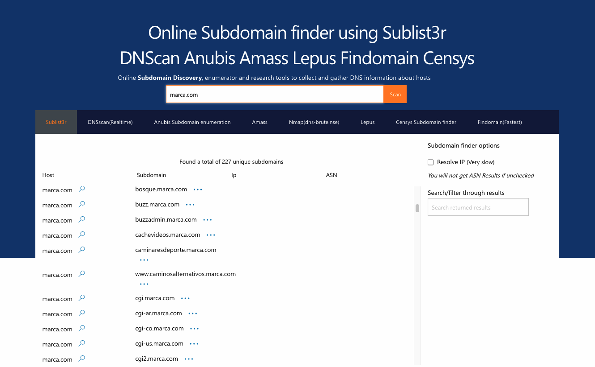

# Recursos de Hacking Ético

## Enumeración web

La enumeración web consiste en ver qué directorios que están expuestos al público existen en una aplicación web. Hay muchas herramientas para esto y hay otras que nos dicen los subdominios que puede haber dado un host.

### dirb

dirb es un herramienta que viene incluida con Kali Linux y que nos permite conseguir los directorios que hay en un aplicación web a través de un fichero de texto con ciertos directorios comunes.
Para ejecutarlo haríamos:

```sh
└─$ dirb http://45.33.32.156

-----------------
DIRB v2.22
By The Dark Raver
-----------------

START_TIME: Sat Apr 24 07:27:47 2021
URL_BASE: http://45.33.32.156/
WORDLIST_FILES: /usr/share/dirb/wordlists/common.txt

-----------------

GENERATED WORDS: 4612

---- Scanning URL: http://45.33.32.156/ ----
==> DIRECTORY: http://45.33.32.156/.svn/
```

Es un análisis costoso en tiempo ya que va probando palabra por palabra y puede llevar mucho tiempo.

Otra herramienta online que nos puede ayudar a encontrar un subdominio es https://www.nmmapper.com/sys/tools/subdomainfinder/.

Simplemente introducimos la url y él se encargará de darnos el resto:



### brute_dirs

Es un módulo de metasploit al que le indicamos cómo podría llamarse el directorio y él genera todas las combinaciones posibles y va probando de una en una contra el host que le digamos.
Para acceder a él tenemos que ejecutar `msfconsole` en la terminal y una vez dentro usar el módulo `use auxiliary/scanner/http/brute_dirs`.
Si ejecutamos el comando info nos dará la siguiente información:
```sh
Basic options:
  Name     Current Setting  Required  Description
  ----     ---------------  --------  -----------
  DELAY    0                yes       The delay between connections, per thread, in milliseconds
  FORMAT   a,aa,aaa         yes       The expected directory format (a alpha, d digit, A upperalpha)
  JITTER   0                yes       The delay jitter factor (maximum value by which to +/- DELAY) in milliseconds.
  PATH     /                yes       The path to identify directories
  Proxies                   no        A proxy chain of format type:host:port[,type:host:port][...]
  RHOSTS                    yes       The target host(s), range CIDR identifier, or hosts file with syntax 'file:<path>'
  RPORT    80               yes       The target port (TCP)
  SSL      false            no        Negotiate SSL/TLS for outgoing connections
  THREADS  1                yes       The number of concurrent threads (max one per host)
  TIMEOUT  20               yes       The socket connect/read timeout in seconds
  VHOST                     no        HTTP server virtual host

Description:
  This module identifies the existence of interesting directories by
  brute forcing the name in a given directory path.

```

Habría que cambiar la opcion RHOST por el host que queremos:
```sh
msf6 auxiliary(scanner/http/brute_dirs) > set RHOST 45.33.32.156
RHOST => 45.33.32.156
```

Y después ejecutar `run` para lanzar el análisis.

Dentro de metasploit hay un montón de módulos que nos pueden venir muy bien. Algunos de los más utilizados son los de WordPress que permiten listar usuarios.

Hay otra herramienta llamada **wpscan** que nos permite listar los plugins que tenga instalado un WordPress y de ahí podemos intentar buscar alguna vulnerabilidad que tenga. Viene instalado con Kali Linux y se ejecuta así:

```sh
wpscan --url http://blablabla.bla --enumerate p
```

Y nos daría una salida parecida a esta:

```sh
[+] contact-form-7
 | Location: https://www.blabla.com/wp-content/plugins/contact-form-7/
 | Latest Version: 5.4 (up to date)
 | Last Updated: 2021-02-24T12:24:00.000Z
 |
 | Found By: Urls In Homepage (Passive Detection)
 | Confirmed By: Urls In 404 Page (Passive Detection)
 |
 | Version: 5.4 (100% confidence)
 | Found By: Query Parameter (Passive Detection)
 |  - https://www.blabla.com/wp-content/plugins/contact-form-7/includes/css/styles.css?ver=5.4
 | Confirmed By:
 |  Readme - Stable Tag (Aggressive Detection)
 |   - https://www.blabla.com/wp-content/plugins/contact-form-7/readme.txt
 |  Readme - ChangeLog Section (Aggressive Detection)
 |   - https://www.blabla.com/wp-content/plugins/contact-form-7/readme.txt

[+] js_composer
 | Location: https://www.blabla.com/wp-content/plugins/js_composer/
 | Last Updated: 2021-02-19T13:58:42.000Z
 | [!] The version is out of date, the latest version is 6.6.0
 |
 | Found By: Urls In Homepage (Passive Detection)
 | Confirmed By:
 |  Urls In 404 Page (Passive Detection)
 |  Body Tag (Passive Detection)
 |
 | Version: 5.8.4 (80% confidence)
 | Found By: Body Tag (Passive Detection)
 |  - https://www.blabla.com/, Match: 'js-comp-ver-5.8.4'
 | Confirmed By: Query Parameter (Passive Detection)
 |  - https://www.blabla.com/wp-content/plugins/js_composer/assets/css/js_composer.min.css?ver=5.8.4
 |  - https://www.blabla.com/wp-content/plugins/js_composer/assets/js/dist/js_composer_front.min.js?ver=5.8.4

[+] revslider
 | Location: https://www.blabla.com/wp-content/plugins/revslider/
 | Last Updated: 2021-04-15T09:34:51.000Z
 | [!] The version is out of date, the latest version is 6.4.8
 |
 | Found By: Urls In Homepage (Passive Detection)
 | Confirmed By:
 |  Urls In 404 Page (Passive Detection)
 |  Meta Generator (Passive Detection)
 |
 | Version: 6.2.18 (100% confidence)
 | Found By: Meta Generator (Passive Detection)
 |  - https://www.blabla.com/, Match: 'Powered by Slider Revolution 6.2.18'
 | Confirmed By: Release Log (Aggressive Detection)
 |  - https://www.blabla.com/wp-content/plugins/revslider/release_log.html, Match: 'Version 6.2.18 (11th August 2020)'

[+] ut-portfolio
 | Location: https://www.blabla.com/wp-content/plugins/ut-portfolio/
 |
 | Found By: Urls In Homepage (Passive Detection)
 | Confirmed By: Urls In 404 Page (Passive Detection)
 |
 | Version: 1.0 (100% confidence)
 | Found By: Readme - Stable Tag (Aggressive Detection)
 |  - https://www.blabla.com/wp-content/plugins/ut-portfolio/readme.txt
 | Confirmed By: Readme - ChangeLog Section (Aggressive Detection)
 |  - https://www.blabla.com/wp-content/plugins/ut-portfolio/readme.txt

[+] ut-shortcodes
 | Location: https://www.blabla.com/wp-content/plugins/ut-shortcodes/
 |
 | Found By: Urls In Homepage (Passive Detection)
 | Confirmed By: Urls In 404 Page (Passive Detection)
 |
 | The version could not be determined.

[+] wordpress-seo
 | Location: https://www.blabla.com/wp-content/plugins/wordpress-seo/
 | Latest Version: 16.1.1 (up to date)
 | Last Updated: 2021-04-06T15:56:00.000Z
 |
 | Found By: Comment (Passive Detection)
 |
 | Version: 16.1.1 (100% confidence)
 | Found By: Comment (Passive Detection)
 |  - https://www.blabla.com/, Match: 'optimized with the Yoast SEO plugin v16.1.1 -'
 | Confirmed By:
 |  Readme - Stable Tag (Aggressive Detection)
 |   - https://www.blabla.com/wp-content/plugins/wordpress-seo/readme.txt
 |  Readme - ChangeLog Section (Aggressive Detection)
 |   - https://www.blabla.com/wp-content/plugins/wordpress-seo/readme.txt

[!] No WPScan API Token given, as a result vulnerability data has not been output.
[!] You can get a free API token with 25 daily requests by registering at https://wpscan.com/register

[+] Finished: Sat Apr 24 07:47:24 2021
[+] Requests Done: 53
[+] Cached Requests: 7
[+] Data Sent: 17.099 KB
[+] Data Received: 2.32 MB
[+] Memory used: 207.254 MB
[+] Elapsed time: 00:00:19
```

[Volver al inicio](./../README.md)
