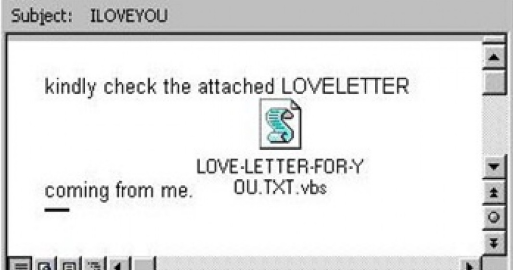

# Recursos de Hacking Ético

## Ingeniería social: introducción

Se calcula que más del 80% de los ataques que se producen en empresas son utilizando técnicas del ingeniería social. Seguramente hayas oído hablar del phising ya que es una de las estrategias más comunes pero no la única. El objetivo de la ingeniería social es conseguir que alguien haga algo que normalmente no lo haría y menos si es alguien que no conoce. Un ejemplo es facilitar las el nombre de usuario o contraseña a alguien que no conoce.
Hay 6 principios que hace que nuestras estrategias de ingeniería social tenga más o menos éxito:

* Reciprocidad: normalmente las personas nos sentimos obligadas o con la necesidad de hacer algo por alguien cuando esa persona nos ha hecho un favor previamente. Uno de los ejemplos más típicos es cuando una empresa nos da muestras gratuitas de algo. Al recibir esas muestras de manera gratuita si queremos comprar un producto será de esa empresa con mayor probabilidad.
* Compromiso: si alguien se compromete con algo vamos a estar más atentos a su compromiso. Como por ejemplo, cuando yo digo "mañana publicaré X".
* Prueba social: Cuando nosotros vemos a alguien que ya ha probado algo tendemos a confiar más en ello. Por ejemplo, si ves a tu vecino comer una comida que nunca antes había existido y ves que no se muere, confiarás más en ese producto.
* Autoridad: desde que somos pequeños nos enseñan a respetar a la autoridad, ya sea al profesor, policía, padres, madres, etc... Si recibimos una llamada de la policía hay mayor probabilidad de que prestemos atención a lo que nos dice que si nos llama un comercial.
* Atracción: si alguien nos gusta es más probable que confiemos en lo que hace, dice o su manera de pensar.
* Escasez: la escasez de un producto nos provoca que lo percibamos como un producto de mayor valor. Por ejemplo, se han vendido PS5 en el mercado de segunda mano por un precio mucho mayor que el de venta ya que era muy difícil encontrar una PS5 en las tiendas.

Uno de los virus más famosos que usaron ingeniería social fue ILOVEYOU. Básicamente era un virus que se mandaba por email con un documento de texto y se veía como en la siguiente imagen:

El documento de texto no era un documento de texto. Windows lo mostraba como LOVE-LETTER-FOR-YOU.txt pero realmente la extensión era `.vbs`. Esto funcionaba debido a que Windows no mostraba las extensiones conocidas.

### Vectores de ataque

* Phishing: es el más famoso y se puede ver en webs que parecen la original, emails que parecen mandados desde una compañía real o incluso en SMSs.
* Vishing: Es el uso de llamadas telefónicas para obtener información.
* Smishing: Es el phising pero usando SMSs.
* Interpretación: básicamente se trata de intentar ser alguien que no eres para poder acceder, por ejemplo, a un edificio.

[Volver al inicio](./../../README.md)

