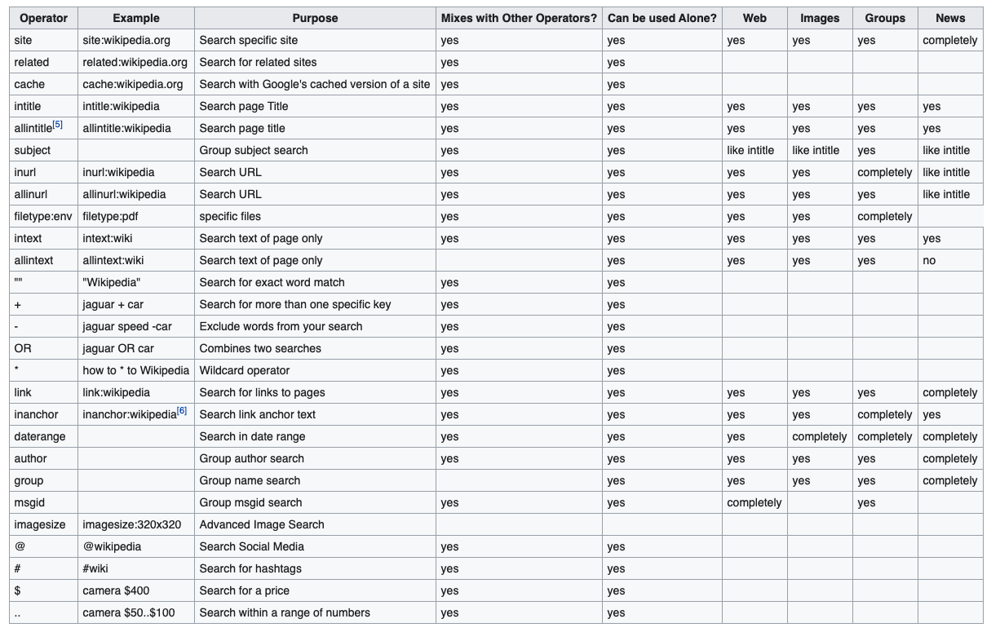

# Recursos de Hacking Ético

## Google Hacking

Cuando hablamos de Google Hacking no hablamos de hackear Google, evidentemente, sino de utilizar Google de tal forma que nos permita encontrar información de nuestro objetivo. Google permite utilizar ciertas keywords que nos ayudará a filtrar y encontrar los resultados que queremos de manera más rápida. De hecho, [exploit-db](https://www.exploit-db.com/google-hacking-database) nos da una base de datos de búsquedas con keywords que dan resultas sensibles.
Por ejemplo, podríamos buscar en Google todos los sitios que tienen una ruta wp-admin que es el login por defecto que trae Wordpress.
Algunas de las keywords que permite Google son:

[Volver al inicio](./../../README.md)
