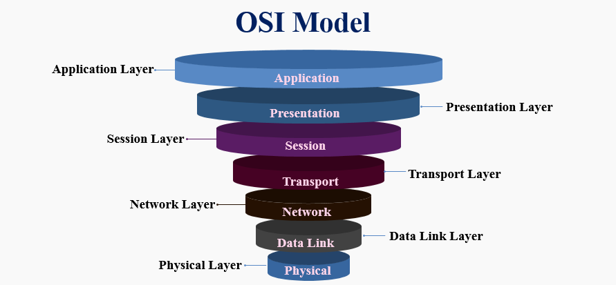
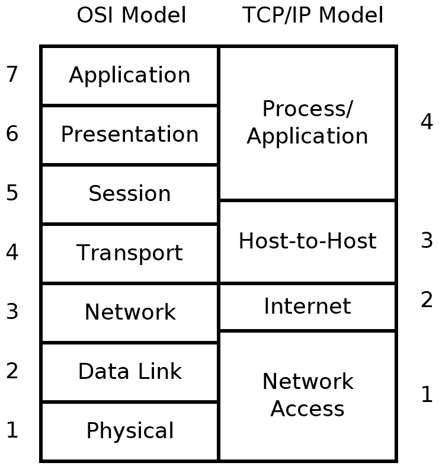

# Recursos de Hacking Ético

## 1. Modelos de comunicación

En este apartado vamos a ver algunos conceptos básicos de redes que aunque parezca que no está muy relacionado con el hacking ético nos vendrán muy bien para entender futuros conceptos. Al final cuando hacemos un pentesting estamos interactuando con una red y saber lo básico de como ella funciona es necesario.

## Modelos de comunicación

Los modelos de comunicación que vamos a ver están divididos en capas y cada capa está puesta una encima de otra. Tenemos que tener en cuenta que cada una de estas capas están separadas y que cada una tiene una función distinta. Cuando dos sistemas se comunican cada uno tiene las mismas capas y cada capa solo puede hablar con la correspondiente capa del otro sistema. Esto es porque cada capa tiene un protocolo y se entienden entre las dos.

### Modelo Open System Interconnection (OSI)

El modelo OSI contiene siete capas cada una con una funcionalidad específica, a veces se refiere a cada capa por su número y no por su nombre. Las capas del modelo OSI son las siguientes:

* Application (capa 7): es la más cercana al usuario final. Lo cual no quiere decir que sea la aplicación en sí. Hablamos de protocolos y esta capa maneja los protocolos necesarios que la aplicación usa. Por ejemplo, HTTP es un protocolo de la capa 7.
* Presentation (capa 6): es la capa que se encarga de preparar los datos para la capa 7, es decir, que está en el formato adecuado para poder ser consumida por la capa 7. Por ejemplo, ASCII, Unicode o JPEG pertenecen a la capa 6.
* Session (capa 5): se encarga de controlar el dialogo entre las aplicaciones de los endpoints. Los Remote procedure calls (RPCs) es un ejemplo de protocolo de la capa 5.
* Transport (capa 4): es la que se encarga de que no haya errores durante la transferencia de datos entre el emisor y el receptor. TCP y UDP son protocolos de ésta capa.
* Network (capa 3): ésta capa se encarga de comunicar dos sistemas. El protocolo IP pertenece a la capa 3.
* Data Link (capa 2): es la que se encarga de la transferencia fiable de datos entre dos máquinas conectadas directamente (local). El protocolo ARP (Address Resolution Protocol), Virtual Local Area Networks (VLANs) o Ethernet son protocolos que pertenecen a la capa 2.
* Physical (capa 1): El nombre de esta capa hablar por sí misma y se refiere a los protocolos que controlan comunicaciones físicas como 10BaseT, 10Base2, 100BaseTX y 1000BaseT.

Uno de los problemas que tiene el OSI model es que no siempre es fácil de mapear un protocolo con una de las capas. Por ejemplo, el protocolo SSH ¿Dónde iría? ¿Sería Session layer o Presentation Layer?

### Arquitectura TCP/IP

En esta arquitectura se reduce el número de capas. En la imagen se muestra como encajaría con el modelo OSI. Básicamente es una simplificación del modelo OSI pero normalmente cuando escuches hablar a alguien sobre capas, con mucha seguridad, hará referencia al modelo OSI y no al TCP/IP

[Volver al inicio](./../../README.md)
