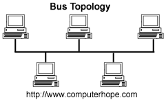
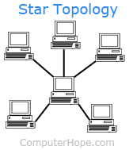
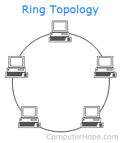
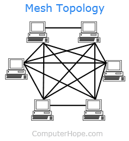
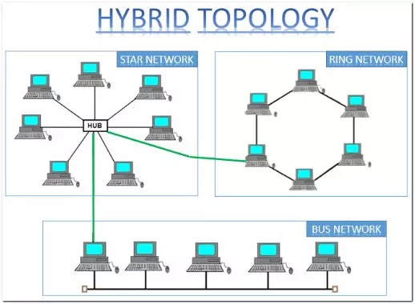

# Recursos de Hacking Ético

## 2. Topologías de red

La forma en que las redes están diseñadas también siguen un modelo conceptual y las topologías nos sirven para mapear su diseño a una representación lógica y poder entenderlo mejor.

## Bus network

Como se muestra en la imagen, consiste en un solo cable de red que conecta cada uno de los dispositivos a la red.

## Star network

La diferencia con la bus network es que hay un dispositivo en medio de todos los dispositivos. Este puede ser un hub o un switch.

## Ring network

Es similar a la bus network en el sentido de que parece que todos los sistemas están conectados entre sí directamente y que se comunican a través del anillo, pero los datos viajan de nodo a nodo y los anillos pueden ser unidireccionales o bidireccionales.

## Mesh network

Es otro tipo de topología que se parece a la ring pero es más como un peer to peer. No están conectados directamente a un switch o hub.

## Hybrid network

Cada una de las anteriores topologías puede ser útil en distintas circunstancias y a veces podemos encontrarnos en una misma red distintas topologías como se indica en la imagen.

[Volver al inicio](./../../README.md)
