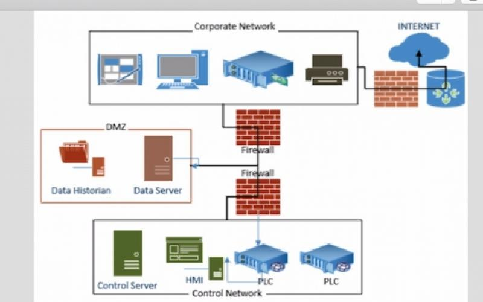

# Recursos de Hacking Ético

## Defense in Depth y Defense in Breadth

### Defense in Depth

Este concepto es muy fácil de explicar si pensamos en Minas Tirith de El señor de los Anillos que es lo que se puede ver en la fotografía:

Esta ciudad tiene 7 anillos que servían de protección por si el enemigo atacaba. Si el enemigo conseguía pasar el primer círculo los habitantes retrocedían hasta el segundo círculo y así sucesivamente. ¿De qué vale esto en ciberseguridad? Pues cuando tenemos una red que se protege por capas ganamos tiempo ya que el atacante tendrá que pasar de capa en capa y nosotros tenemos la esperanza de detectar el ataque antes de que el atacante llegue a la información sensible.

Como paso en El Señor de los Anillos hay veces que 7 capas no son suficientes. En la siguiente imagen puedes ver un diseño de una red aplicando Defense in Depth:

### Defense in Breadth

Si buscas este termino en Internet es complicado encontrar una definición exacta. Se discute mucho si defense in depth es suficiente o se necesita aplicar defense in breadth. Defense in breadth es todo lo que defense in depth no presta atención. Es decir, en la actualidad es más probable que un ataque tenga éxito si se va por el factor humano que escaneando puertos y ver si algún servicio tiene alguna vulnerabilidad que lo comprometa.
Defense in breadth no se trata de prevenir sino de asumir que van a romper tu sistema y tener mecanismos de detección para pararlo cuanto antes. Esto podemos conseguirlo teniendo mecanismos que hagan logging de lo que pasa en los sistemas y que lo auditen y busquen patrones que indiquen que podemos estar siendo atacados.

[Volver al inicio](./../../README.md)
