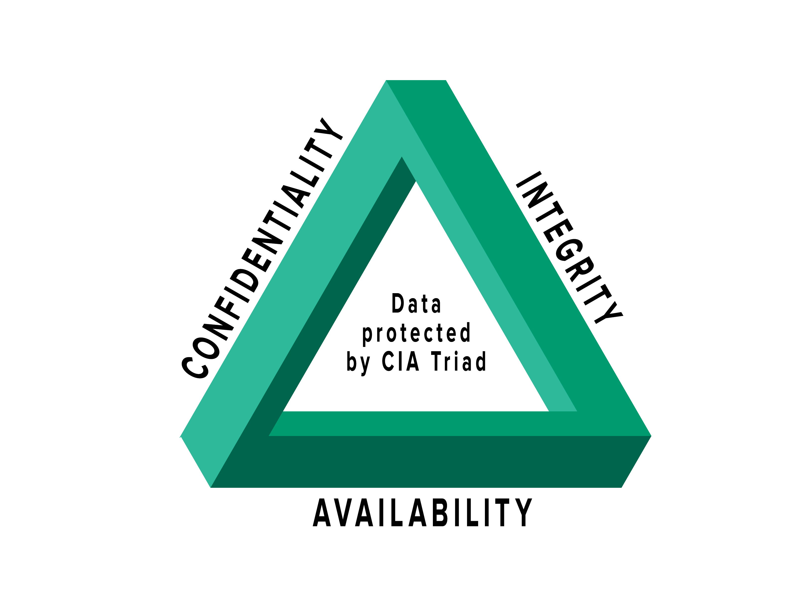

# Recursos de Hacking Ético

## 1. La tríada

Es una forma de definir qué es la seguridad. Está formada por tres elementos que son: confidencialidad, integridad y disponibilidad. Se conoce en inglés como CIA (Confidentiality, Integrity y Availability). Los 3 elementos son muy importantes cuando se desarrolla un plan de seguridad.

### Confidencialidad

Pensemos en esto como cuando contamos un secreto a alguien y esperamos que esa persona, en la que confiamos, no se lo cuente a nadie. ¿Qué pasa si se lo cuenta a alguien? Evidentemente el secreto ya no será confidencial y no sabremos si podremos confiar en esa persona nunca más.
Pues en ciberseguridad pasa exactamente lo mismo. La confidencialidad se trata de que nadie pueda acceder a datos a los cuales no tiene acceso. La comunicación entre un cliente y un servidor está cifrada por lo cual hasta la conversación que hay es confidencial.

### Integridad

Es igual de importante mantener los datos de manera confidencial como asegurar que los datos son los mismos cuando se envían desde el servidor que cuando se reciben en el cliente. También se trata de que los datos no se corrompan en una base de datos, por ejemplo. Es importante tener backups de la información para que en caso de que se produzca una pérdida de información podamos restaurarlos. Uno de los ataques más famosos que afectan a la integridad es "man in the middle".

### Disponibilidad

¿Qué pasa si un usuario, debido a una caída en el servicio, no puede acceder a la información? Esto es lo que significa disponibilidad. No necesariamente es un ataque pero si que rompe uno de los tres elementos de la tríada. Por ejemplo, un ataque de denegación de servicio afectaría a la disponibilidad de la información para un usuario.

[Volver al inicio](./../../README.md)
